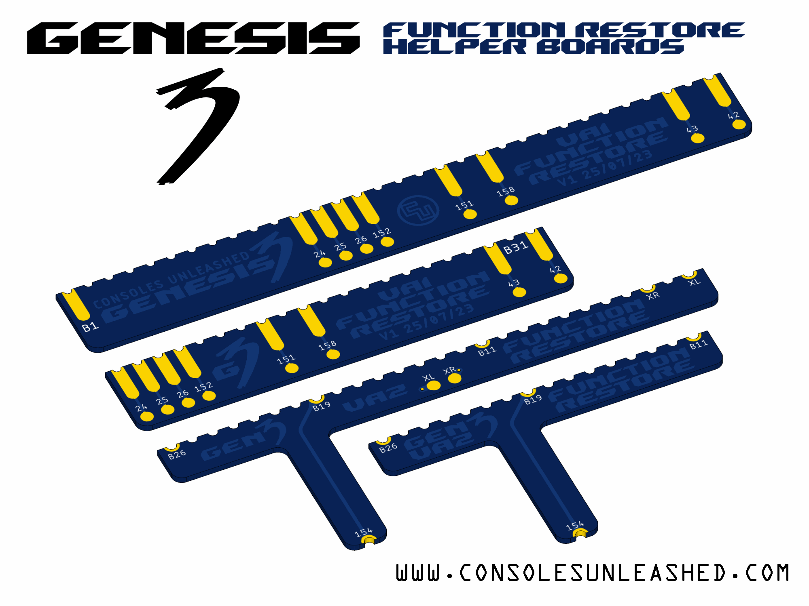

Working on designs to release for free can be both time consuming and expensive. If you like what I do, a small donation will go a long way in helping me continue to serve the modding community as best as I can, with many more free and original guides, designs, and ideas to come.

# Sega Genesis 3 Function Restore Helper Boards

Sega Genesis 3 function restore helper boards are designed to make wiring easier and cleaner when restoring the removed functions from Sega Genesis 3 consoles. Especially useful for "VA1" revision which requires soldering between the cartridge port plastic and PCB which can be difficult to do well.

## Mod Kit Variants

The function restore helper boards come in two main versions catered for the "VA1" and the VA2 revision Genesis 3 motherboards.

- VA1 Standard - Looks awesome.
- VA1 Mini - A smaller version.
- VA1 Mini Compensated - A smaller version with pads in order of destination solder point so no wires need to be crossed.
- VA2 standard - Quick solder board with pads for Mega CD passthrough audio.
- VA2 Mini - A smaller version without the Mega CD audio pads.

## Manufacturing

- 0.6mm is ideal. 0.8mm is also good. 1mm is ok. 1.2mm is too much. 1.6mm is stupid.
- Get them in blue or else.
- Castellated vias are recommended. Failure to get castellated will mean the half cut vias will need cleaning and also potentially have torn off copper plating during manufacturing. Might be fine though.

## Install Guide

https://www.consolesunleashed.com/guides/sega-genesis-3-function-restore-install-guide/

## Future Work

A full no-wire flex PCB design for "VA1" that will extend from the cart port to all wiring destinations. This has been roughed out, but not owning a "VA1" means that the ability to finish the design is hindered. If you can donate a "VA1" Genesis 3 or sell me one, it will help a lot. Thanks

## Version History

### VA1 Standard / Mini

- V1 - 25/07/2023
- V1.1 - 12/08/2023

### VA2 Standard / Mini

- V1 - 27/07/2023
- V1.1 - 20/08/2023

## License

If you use this in any way, shape or form, you must include a link back to this repository and mention me by name on any sales pages and social media posts. Not only will this help me to keep designing mod kits and offering them to the community, but it is basic common courtesy as well. Don't be a douchebag. :)

Also this 'GNU GENERAL PUBLIC LICENSE Version 2, June 1991'.

## Donate

Working on designs to release for free can be both time consuming and expensive. If you like what I do, a small donation will go a long way in helping me continue to serve the modding community as best as I can, with many more free and original guides, designs, and ideas to come.

